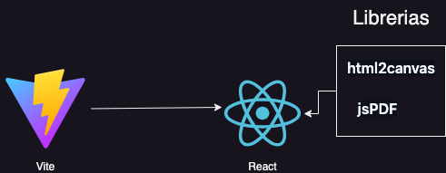

# Indice
Recurso estatico para realizar un cv sin dependecias instaladas en el package.json

## Aplicación
imagen de representacion de la app:


## Comandos
* npm run dev: para ejecutar la aplicación
* npm run build: para construir la aplicación

```
en este comando se encarga de construir la app y copiar directorios images y librarys el comando es para mac tenerlo en cuenta en el package.json:

"build": "vite build && cp -R src/assets/images ../page && cp -R src/assets/librarys ../page",

```
hay algunos errores producidos por la version de vite
```
deben poner exactamente asi en el index.html: 
<script type="module" crossorigin src="assets/index-BAU9OtcN.js"></script>
    
<link rel="stylesheet" crossorigin href="assets/index-DcAij2k-.css">

una parte más abajo deben descomentar las lineas para las librerias desde el parrafo para desarrollo:

<script src="src/assets/librarys/html2canvas/html2canvas.min.js"></script>
<script src="src/assets/librarys/jsPDF/jspdf.umd.min.js"></script> 

una parte más abajo deben descomentar las lineas para las librerias desde el parrafo para producción:

<script src="librarys/html2canvas/html2canvas.min.js"></script>
<script src="librarys/jsPDF/jspdf.umd.min.js"></script>

```

