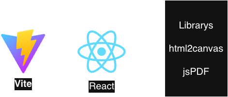

# Indice

Recurso estatico para realizar un cv sin dependecias instaladas en el package.json

## Aplicación

imagen de representacion de la app:


## Comandos

- npm run dev: para ejecutar la aplicación en modo desarrollo
- npm run build: para construir la aplicación en modo producción

### Desarrollo

```
"dev": " NODE_ENV=development node scriptLines && vite",

en este comando se encarga de ejecutar la app y ejecutar un script para que las lineas 
const dev = [
  '<!-- para desarrollo poner estas direcciónes de las librerias -->',
  '<script src="/src/assets/librarys/html2canvas/html2canvas.min.js"></script>',
  '<script src="/src/assets/librarys/jsPDF/jspdf.umd.min.js"></script>'
];
se agregen al index.html para que funcione la app en desarrollo

```


### Producción

```
"build": "vite build && cp -R src/assets/images page && cp -R src/assets/librarys page && NODE_ENV=production node scriptLines && mv -f page/* ..",

en este comando se encarga de construir la aplicación, copiar las imagenes y librerias, setear la variable de entorno de produccion, ejecutar la app y ejecutar un script para agregar las lineas 
const prod = [
  '<!-- para producción poner estas direcciónes de las librerias -->',
  '<script src="librarys/html2canvas/html2canvas.min.js"></script>',
  '<script src="librarys/jsPDF/jspdf.umd.min.js"></script>'
];
se agregen al index.html para que funcione la app en producción
```


### Video

demo de uso de CV

[Watch the video on YouTube](https://www.youtube.com/watch?v=v5_gz_25gC0)